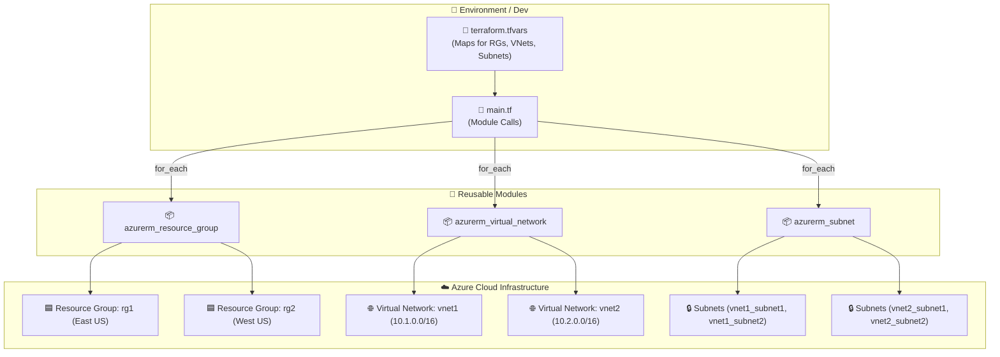

<div align="center">

# ☁️ Azure Landing Zone Terraform Framework

[](https://www.terraform.io/)
[](https://registry.terraform.io/providers/hashicorp/azurerm/latest)
[](LICENSE)
[](#-architecture--design)

*A modular, scalable, and data-driven Infrastructure as Code (IaC) framework for provisioning Azure Landing Zone infrastructure using Terraform.*

</div>

---

## 📌 Table of Contents

- [Overview](#-overview)
- [Key Features](#-key-features)
- [Architecture \& Design](#-architecture--design)
- [Repository Structure](#-repository-structure)
- [Terraform Modules](#-terraform-modules)
- [Getting Started](#-getting-started)
  - [Prerequisites](#prerequisites)
  - [Authentication](#authentication)
  - [Deployment Steps](#deployment-steps)
- [Configuration Example](#-configuration-example)
- [Best Practices](#-best-practices)
- [License](#-license)

---

## 🚀 Overview

This repository provides an enterprise-ready **Azure Landing Zone (LZ)** infrastructure foundation built with **HashiCorp Terraform**. 

Instead of hardcoding resource blocks, this codebase utilizes a **data-driven design pattern**. Infrastructure specifications are defined inside HCL variable maps (`terraform.tfvars`) and dynamically expanded via `for_each` loops across reusable custom modules.

---

## ✨ Key Features

- 🏗️ **Data-Driven Architecture**: Easily add or modify Resource Groups, VNets, and Subnets by updating map structures without altering module code.
- 🧱 **Reusable Modules**: Decoupled, single-responsibility modules for Azure core resources (`Resource Groups`, `Virtual Networks`, `Subnets`).
- 🌐 **Multi-Environment Support**: Clean directory isolation between environments (`Dev`, `pre-prod`).
- ⚡ **Dynamic Resource Scaling**: Built with native Terraform `for_each` iteration for flexible environment scaling.
- 🔒 **Azure Provider v5 Ready**: Pre-configured for standard Azure provider requirements and features.

---

## 📐 Architecture & Design

The diagram below illustrates how environment configurations call reusable core modules to instantiate resources in Azure:



---

## 📁 Repository Structure

```text
.
└── Terraform-LZ-Test/
    ├── Environment/
    │   ├── Dev/
    │   │   ├── main.tf             # Module invocations for Dev environment
    │   │   ├── provider.tf         # Terraform required providers (azurerm ~> 5.0.0)
    │   │   ├── variable.tf         # Input variable declarations (resource_group, virtual_network, subnet)
    │   │   └── terraform.tfvars    # Environment variable map definitions
    │   └── pre-prod/               # Pre-production environment configuration space
    ├── modules/
    │   ├── azurerm_resource_group/ # Module for creating Azure Resource Groups
    │   │   ├── main.tf
    │   │   └── variable.tf
    │   ├── azurerm_virtual_network/# Module for creating Azure VNets
    │   │   ├── main.tf
    │   │   └── variable.tf
    │   └── azurerm_subnet/         # Module for creating Azure Subnets
    │       ├── main.tf
    │       └── variable.tf
    └── README.md                   # Project documentation
```

---

## 📦 Terraform Modules

### 1️⃣ Resource Group (`azurerm_resource_group`)
Dynamic module that iterates over resource group map specifications.
- **Input Variable**: `rgs` (Map of objects containing `name` and `location`)
- **Resource**: `azurerm_resource_group.rg`

### 2️⃣ Virtual Network (`azurerm_virtual_network`)
Creates virtual networks associated with designated resource groups and CIDR address spaces.
- **Input Variable**: `vnets` (Map of objects containing `name`, `location`, `resource_group_name`, and `address_space`)
- **Resource**: `azurerm_virtual_network.vnet`

### 3️⃣ Subnet (`azurerm_subnet`)
Creates subnets linked to specific virtual networks.
- **Input Variable**: `snets` (Map of objects containing `name`, `resource_group_name`, `virtual_network_name`, and `address_prefix`)
- **Resource**: `azurerm_subnet.subnet`

---

## 🛠️ Getting Started

### Prerequisites

Ensure you have the following installed on your local environment:
- [Terraform CLI](https://developer.hashicorp.com/terraform/downloads) (>= v1.5.0)
- [Azure CLI](https://learn.microsoft.com/en-us/cli/azure/install-azure-cli) (>= v2.50.0)
- An active **Azure Subscription** with Owner or Contributor permissions

### Authentication

Authenticate to Microsoft Azure via the Azure CLI:

```bash
az login
az account set --subscription "YOUR_SUBSCRIPTION_ID"
```

### Deployment Steps

1. **Navigate to your target environment directory**:
   ```bash
   cd Environment/Dev
   ```

2. **Initialize Terraform**:
   Initializes the backend, downloads provider plugins (`azurerm v5.0.0`), and sets up modules.
   ```bash
   terraform init
   ```

3. **Validate Configuration**:
   Ensures HCL syntax and configuration integrity.
   ```bash
   terraform validate
   ```

4. **Generate Execution Plan**:
   Review planned changes against current state.
   ```bash
   terraform plan
   ```

5. **Apply Configuration**:
   Provision the resources into Azure.
   ```bash
   terraform apply
   ```

6. **Destroy Resources** *(Optional)*:
   Clean up resources when testing is complete.
   ```bash
   terraform destroy
   ```

---

## ⚙️ Configuration Example

Defining infrastructure components is completely data-driven. Below is an example of `terraform.tfvars`:

```hcl
resource_group = {
  rg1 = {
    name     = "rg1"
    location = "East US"
  }
  rg2 = {
    name     = "rg2"
    location = "West US"
  }
}

virtual_network = {
  vnet1 = {
    name                = "vnet1"
    location            = "East US"
    resource_group_name = "rg1"
    address_space       = "10.1.0.0/16"
  }
}

subnet = {
  vnet1_subnet1 = {
    name                 = "vnet1_subnet1"
    virtual_network_name = "vnet1"
    address_prefix       = "10.1.1.0/24"
  }
}
```

---

## 🔒 Best Practices

1. **Remote State Storage**: For production workflows, configure an Azure Blob Storage container as a remote backend (`azurerm` backend block) with state locking enabled via Storage Account keys / Azure AD.
2. **Least Privilege Access**: Restrict deployment credentials using Azure Service Principals or Managed Identities with RBAC fine-tuning.
3. **Environment Separation**: Keep `Dev`, `pre-prod`, and `prod` state files strictly separated across different state keys/containers.

---

## 📄 License

This repository is maintained for Azure infrastructure testing and automation practice. Free to use and customize for your landing zone deployments!
